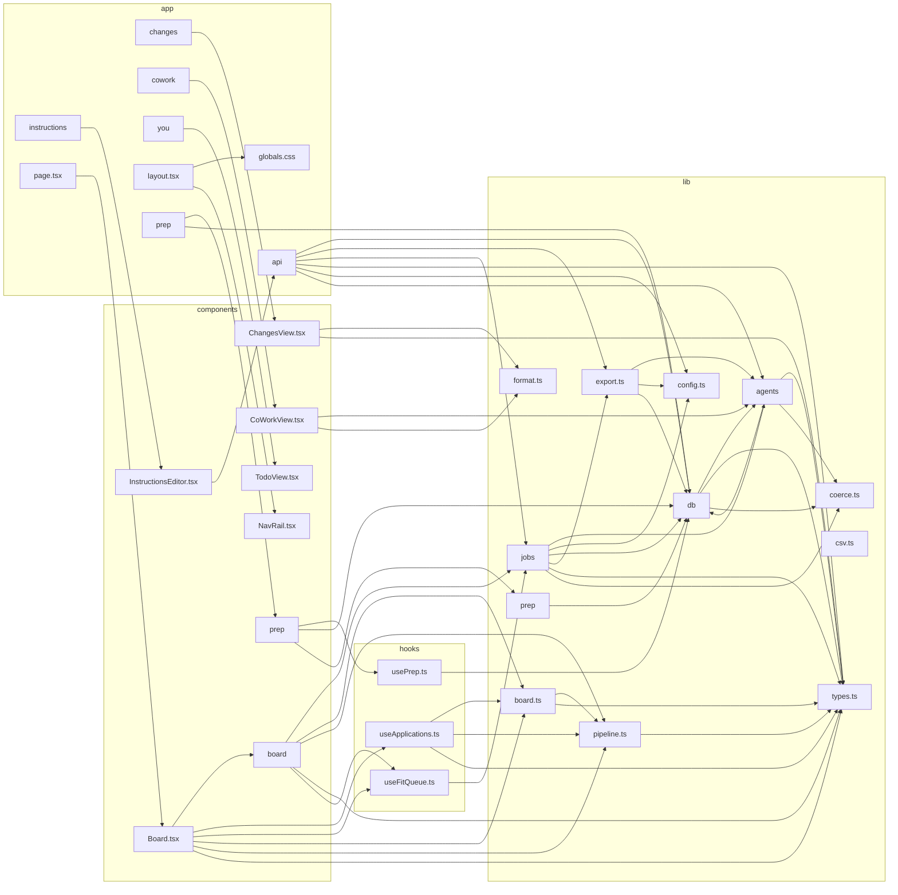

# Architecture diagram

<!-- AUTO-GENERATED — do not edit by hand. Regenerated on every push by
     .github/workflows/architecture-diagram.yml. Run `npm run diagram:arch` to regenerate. Source of truth: the import graph itself. -->

High-level module dependency graph, collapsed to one box per top-level folder
(`app`, `components`, `lib`, `hooks`). An arrow means "imports from".

