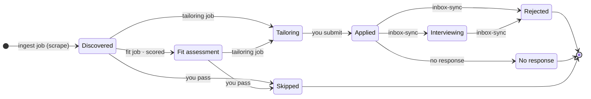

# Application pipeline

<!-- AUTO-GENERATED — do not edit by hand. Regenerated on every push by
     .github/workflows/architecture-diagram.yml. States come from the Status union in lib/types.ts; transitions are declared in scripts/gen-pipeline-diagram.ts (each annotated with where the rule lives). Run `npm run diagram:pipeline` to regenerate. -->

How a posting moves through the board. Each arrow is labelled with the CoWork job
or event that triggers it. Terminal states (rejected, ghost, skipped) collapse into
the board's "Closed" column.

